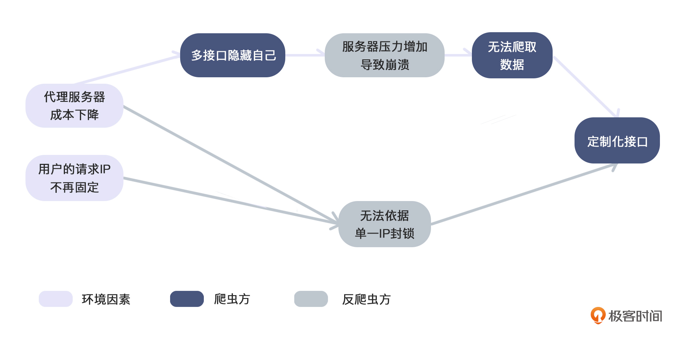
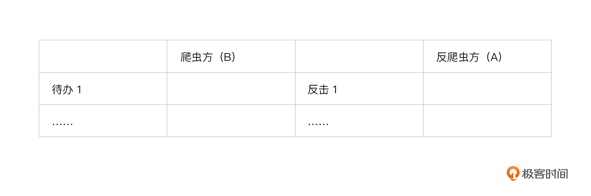
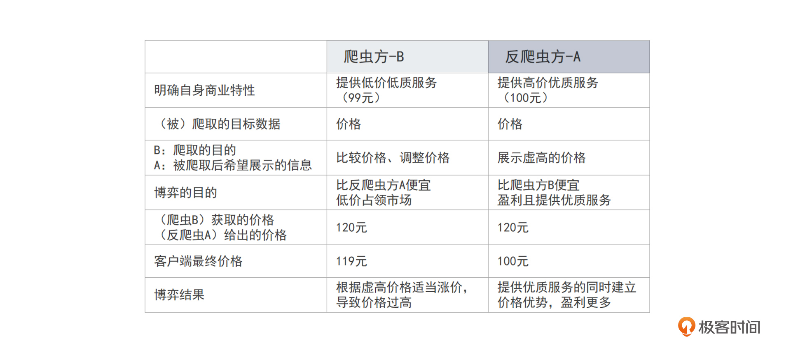
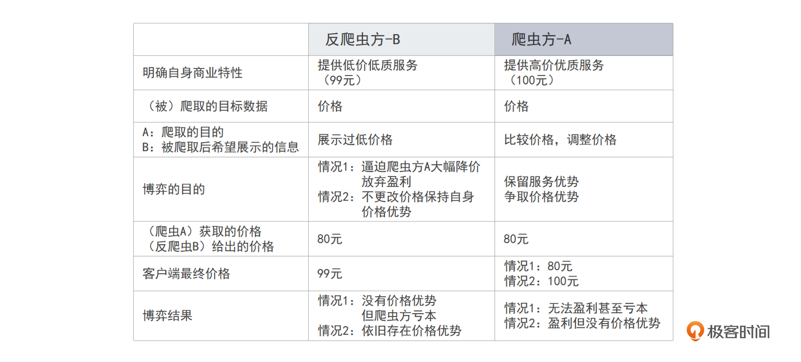
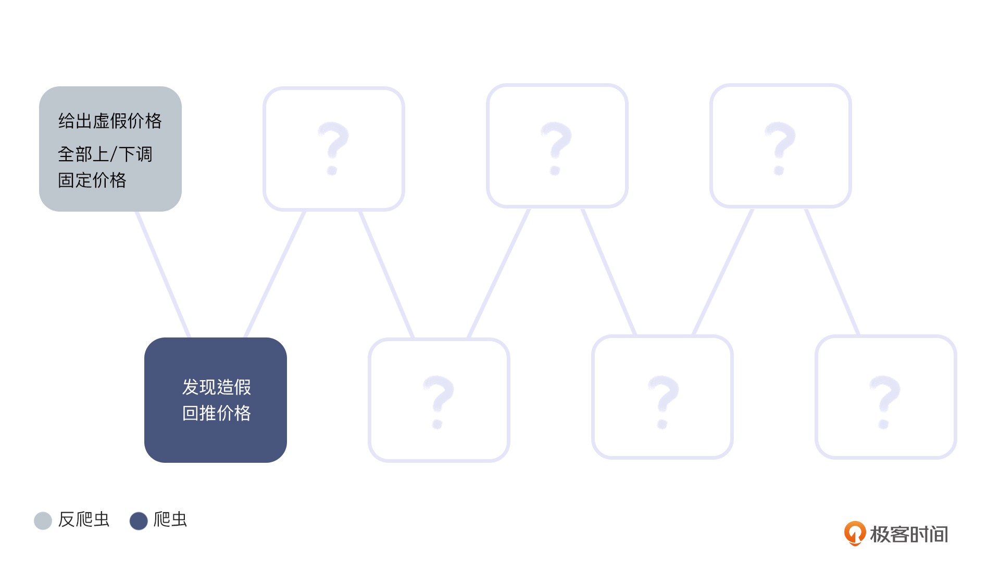
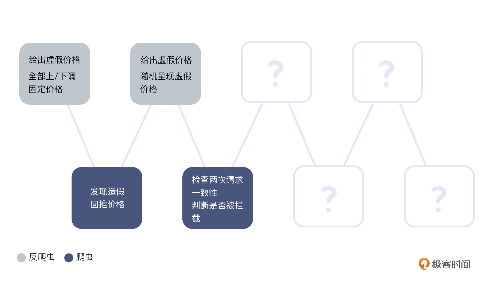
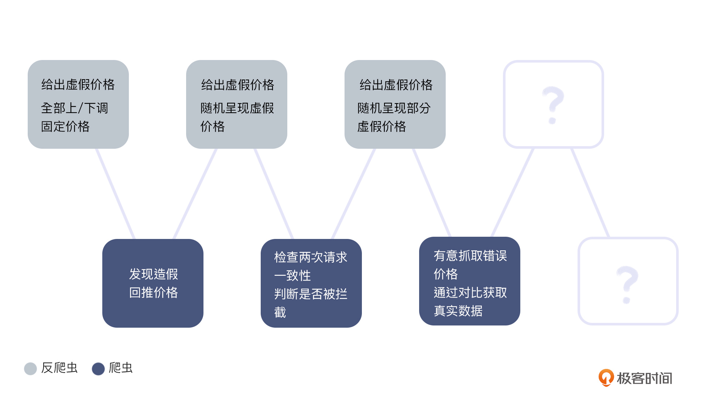
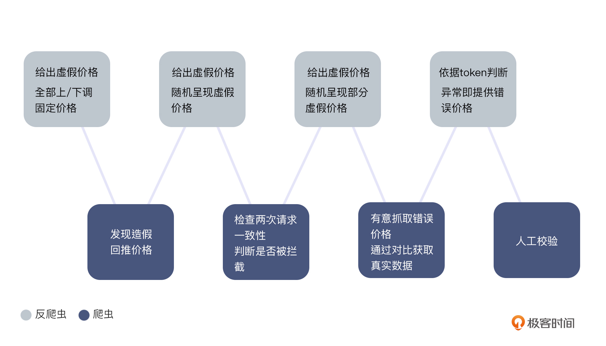
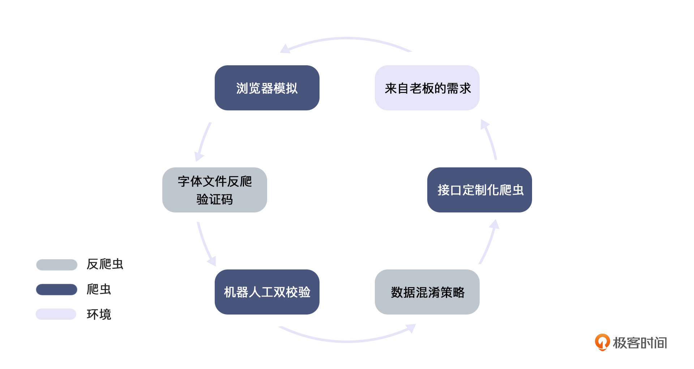

# 02 | 爬虫的内卷和黑化：我们变得不正经啦
<audio src='./02-爬虫的内卷和黑化：我们变得不正经啦.mp3' controls></audio>
你好，我是DS Hunter。

在上节课里，我们讲了上古田园时代和春秋时代的爬虫发展，这个时候爬虫还是有礼节的。但是到了后面的战国时期，就彻底礼崩乐坏，慢慢变得无恶不作了。爬虫也从一门技术，变成了一门生意。

因此，面临这种超出想象的变化，在激烈的对抗间，我们的各类招式也层出不穷。这节课，我们就聚焦到战国时代，我会给你讲解几个在爬虫和反爬虫的斗争期间，双方常用到的招式，像爬虫方常用的接口定制化爬虫、机器人工双校验，以及反爬虫方常用的数据混淆策略和字体文件反爬。

这些招式会按照相互克制的顺序展开。我们一块来看看，在商业的高度内卷下，爬虫变成了什么样子。

## 黑化的爬虫和反爬虫的对抗

在战国时期爬虫和反爬虫的对抗中，服务器的压力已经不再是最大的问题了。

服务器是固定成本，而且大厂通常十分冗余，或者说浪费。即使有部分爬虫来，也不会造成什么影响。这个时候大家更关注的是： **如何在商业上获胜。** 商业竞争逐渐激烈，面对这样的环境，爬虫越来越接口定制化。

### 爬虫第一招：接口定制化爬虫

定制化，简单地说就是只拉接口，不拖泥带水地进行没用的请求。我给你画了一个接口定制化爬虫产生的过程图，你可以参考一下。

最早，爬虫还没有开始接口定制化，而反爬虫会根据IP以及访问频率进行简单的封锁。举例来说，假设一个IP地址只访问你的价格接口，不访问你的其余接口，也不访问静态页面，那么，超过一定的阈值，这个IP地址就会被拉黑。

时间长了，爬虫就会选择多爬一点没用的数据来伪装自己，把想爬的接口隐藏在自己的请求中。但是随着代理服务器成本下降以及大环境的改变，这种方法就不再适用了。

这里还是用价格战来给你举例：如果反爬虫服务器针对一个IP拉黑的阈值是访问10次价格接口，那么爬虫方如果想发起10000次的接口请求，只需要使用1000个代理。

我们先说第一条走向定制化的路， **代理服务器成本下降。** 成本下降，突破IP封锁就从一个技术问题变成了ROI（return on investment，投资回报率）的问题。而能用钱解决的，就不再是问题了。毕竟只要增加代理服务器， **增加接口隐藏自己，** 总是可以爬取到需要的数据的。但是，这样会给对方的服务器带来更大的压力，对方崩了，自己也得不到数据。

而第二条路，不仅和代理服务器成本下降有关，更有大环境影响的因素。随着移动互联网的普及， **用户的请求IP不再是固定的，** 同一个IP上一秒还归路人甲使用，下一秒可能就给路人乙了。反爬虫方也不太敢继续依据固定IP的访问频率封锁了。

**所以，在这个时候，爬虫方开始大胆使用接口定制化的爬虫，而不再使用通用爬虫。** 不过后面这个还会再反转。这个在结尾我们会再谈。

### 反爬第一式：数据混淆策略

爬虫和反爬虫打了一段时间后，反爬虫的业务方就提出了新的要求：就算被爬取了，也要让被爬取的数据产生价值。这里我们创设一个情境来说明。

例如，AB两家公司，A的商业策略是，优先保证盈利，保护股东利益。而B的商业策略是，尽可能低价占领市场。那么当他们互相爬取对方的时候，反爬团队都会如何处理呢？这里我为你准备了一个表格，你可以在学习的时候思考一下，AB两家公司双方都在想些什么。

A公司的日常定价必然是高价优质服务，B公司的日常定价必然是低价低质服务，甚至无服务。

这个时候，B公司的爬虫如果来爬A公司，A公司的业务会如何考虑问题？

1. 我们公司的商品卖100，他们一般是卖99；
2. 对方爬虫抓到我们的价格，一定会在定价的时候减价售卖；
3. 基于这个考虑，我们做一个提价吧，就告诉他们的爬虫，我们卖120；
4. 对方拿到120的价格，一定会降价到比我们低的价格卖，可能就是119。这样，我们的100还是有价格优势的。

   好了，推测先到这里，我给你总结了一张爬虫方B爬取A的思路与做法表格：

爬虫方B公司找反爬虫方A公司爬取数据的情况说完，我们来看看反过来的情况，也就是说，现在博弈中的两个角色变成了爬虫方A和反爬虫方B。

实际上，A公司的爬虫在爬取B公司的时候，B公司的业务必然也是反向思考的。也就是说，B给的价格必然是比实际价格还低一点的（你也可以列表试试推理这种情况）。

这里你也可以参考一下我给你提供的爬虫方A爬取反爬虫方B的博弈过程：

可以看到，B会给出较低的价格（例如表格中的80），有本事你就跟进，我就不信你敢放弃股东利益，降价到这个程度。

这样，同样的商品，本来售价100，结果A告诉B，我卖120。B告诉A，我卖80。爬虫就像一个间谍，拿到数据不可怕，可怕的是拿到错误的数据，给出错误的商业决策。

你看，这个时候，反爬虫方并非专注于技术手段的提升，而是开始利用起了被爬取数据这件事。就算被爬取，也要让这个被对方抓到的数据产生价值。通过给对方错误的信息，使对方产生错误的判断，并在这条路上越走越远。这手段，多不正经。不过也不用觉得复杂，刚刚我们填好的表格，就是这场反爬战的思路。

### 爬虫第二招：机器人工双校验

“机器人工双校验”这个招数，你可以把它看成一个动作链条，在这个链条里的爬虫会使出各种手段与反爬虫方斗争，获取想要的数据。这里的“不正经”成分达到了巅峰，在爬虫与反爬虫的博弈之间，充满了尔虞我诈。

下面是一张机器人工双校验的动作链条示意图（空格处待填写）。接下来我们就一起让整个动作链条完整起来——置身于战场，才能了解隐藏在战争背后的每一个想法。在整个动作链条里，逻辑对抗无处不在，那直接就开始吧。

我们现在来看一个新的战况：爬虫方B公司，在爬取走高端路线的A公司的价格的时候，每次都拿到80。也就是说，反爬虫方A选择用不同的价格迷惑对方。时间长了，爬虫方B公司就会发现不对了：80是一个亏本价格，不符合A走高端路线的风格。稍加分析就会发现：价格被掺假了，下降了20%。

面对刚刚说到的反爬方A的数据混淆策略，爬虫不得不做出改变。那么这个时候爬虫的第一个办法就出现了：既然所有的价格都下降了20%，那么如果我真的无法突破反爬虫系统，就去抓错误的价格，然后再加回来，不就行了吗？我干嘛死磕对面的反爬虫系统呢？没错，它们选择了 **不在技术上交锋，而是用自己的推断得出正确的价格信息。**

现在看来，这样奇葩的做法可能有些不可思议。但是在历史上，这是真实存在的。很多反爬虫系统都有过这样的黑历史，那就是： **防住了，但是等于没有防住。**

- **随机虚假价格和两次请求**

另一方面，面对爬虫的第一个方法——回推价格，反爬方开始了将 **价格的变更幅度做成随机的策略。** 这次展示80的价格，下次展示75的价格，每次都不一样，这样就没办法反推回来了。

为了应对随机变化的价格，爬虫方开始了我们的第一个机器校验方法： **进行两次请求。** 这样，通过检查价格是否一致，就可以轻松校验自己的爬虫系统是否被拦截了。例如，第一次请求一个商品的时候，价格是80，相同的参数再请求一次，价格又变成了75，前后时间可能只差1秒，但是1秒内商品变价的概率并不高——那就可以证明，自己被拦截了。

好了，大致的博弈先告一段落。你可能已经迫不及待开始预测爬虫方下一步的动作了：这个时候是不是就可以停掉爬虫，慢慢调试自己的代码，等每次价格都正确的时候再爬呢？毕竟爬取也是需要消耗资源的。停下来，能有效节约一部分成本，同时，也可以降低对方的服务器资源消耗，避免爬虫把对方爬崩之后两败俱伤。

如果你的回答是：Yes！那么恭喜你，你被反爬虫坑了！因为如果反爬虫方发现你的策略是，错一次就停下来重爬，那么他会无脑给一些低概率的错误价格。

举个例子，对方根本没有发现你的爬虫。但是，反爬虫系统用一个极低的概率，随机给一次错误价格。我们假设，反爬虫方给一次错误价格的概率设置为万分之一。那么，线上用户被影响的概率是极低的，并且影响了也不容易被发现。但是你的爬虫运行一万次，算过来可能就碰到一次错误的价格。如果就这样停下爬虫来调试，一定是一无所获。毕竟，这只是随机事件啊！所以你本着替双方着想的初衷做了这个熔断，但是结果却卷输了自己。实在是太冤枉了。

看看，是不是充满了不正经的尔虞我诈。

- **部分随机价格和有意抓取**

回到爬虫方两次请求的进攻方式，反爬方选择 **让价格不随机。但是不随机不就回到开头的状态了吗？这个时候我们可以选择一个部分随机** 的解法。

简单地说就是，同一个商品，相同时间段内，价格随机幅度不变。例如商品A，价格是100元。当前一小时内你算出一个随机值，例如是13%，那么A商品在这一小时内，将一直提价13%。而另一个商品B在这一小时的提价幅度可能是15%。这样既实现了价格不确定，又避免了被相同请求验算。一举两得。因为相同的请求，必然得到相同的结果。

那么，爬虫方是否还有办法检测自己是否运行正常呢？

有的。答案就是：有意抓取错误价格。

其实道理很简单，相同的数据，相同的时间内价格是一样的。那么，哪个价格是真的我不好找，但哪个价格是假的，我还是很容易找的吧？我有意撞一下反爬不就行了？有意告诉反爬系统，我就是爬虫，快给我假价格。拿到假价格之后，你再进行一次正常的请求，看下是否一致不就行了吗？

- **策略针对和人工校验**

那么现在再绕回来，假设你是反爬方，对方这样检查自己的爬虫是否正常，你如何处理？

答案其实也是显然的，你只需要针对不同的策略返回不同的假价格就行了。举个例子，你的反爬可能依赖一个Token。对方可能用Token缺失的请求来校验。这个时候，你给出13%的提价。当Token存在，但是Token错误的时候，你给出16%的提价。而Token长度不正确，你给出15%的提价。或者Token奇偶校验错误，你给出12%的提价，价格复杂多变起来，这个问题就轻松解决了。

那么爬虫方面对这个办法是不是无能为力了呢？也不是的！

这个时候，爬虫方就可以加入人工校验了。因为爬虫方只需要确认自己是否运行正常，那么只要有一个校验错误，就意味着自己不正常，所以这个成本还是很低的，只需要在爬取到的数据中抽样即可。也就是说，只要用人工来进行抽样检测，就可以在概率上检测自己运行是否正常。

从另一个角度来说，对方针对爬虫给出了各种花式的价格，他能保证100%命中爬虫，而不命中正常人吗？不能。这种价格混淆俗称“下毒”。那么，就像狼人杀里面的女巫一样，你能保证自己不毒到平民吗？不可能的，概率永远是存在的。那么你就可以通过众包的方式让真实的用户去访问，通过比对看到的价格，就可以确认自己是否运行正常。当然，这个过程中也必然会有真实用户被误伤。

也许你会很好奇：误伤了会怎么样呢？

不同的用户看到不同的价格，去投诉竞对大数据杀熟，让他领导开除他啊！

如果你刚刚真的想问这个问题，我还是很高兴的，这证明你还保持着纯真和善良。毕竟从刚刚一来一回的分析中你也肯定感受到了——反爬是一个很腐蚀心智的事情。而你，还是关心真实的用户的。

### 反爬第二式：字体文件反爬

是不是受不了了？快从刚才说的那些腐蚀心智的斗争中拉回来，回到一些正经的话题上来。这里的反爬手段，就没有那么的尔虞我诈了。

为了防止真正的用户受到反爬虫的误伤，通常网上的一些教程一定会教你“字体文件反爬”，也就是说，让展示出的价格使用自定义字体来实现反爬虫。简单地说，你可以创建一个自定义字体。因为字体可以定义文字书写方式，你完全可以在该字体下，将数字打乱。例如“1”显示成“3”，“3”显示成“7”，“7”显示成“5”等等。这样，你下发的价格其实是错误的价格。但是真正的用户通过这个字体文件加载之后，会被mapping（映射），显示成为一个正确的价格，不影响使用。

网络上对这个办法赞赏不已，但是我告诉你：这个办法虽然酷炫，但它其实是一个下下策。

为什么？

第一个， **因为时间成本。** 你想一下，如果你做了这个字体文件，你需要花费多少时间？一天？这算效率高的了吧？但是对方发现之后，mapping回来需要多久？

五分钟。

你拿一天的时间拼人家五分钟，这划算吗？

我在开篇就提到了，反爬虫拼的就是资源。而资源包括机器和人力资源的综合。其中，机器资源成本越来越低，但是人力成本，却随着程序员的工资水涨船高。因此在人力资源上拼亏了，极大可能上，会输掉整个博弈。

除了不划算这个问题，第二点，就是 **依旧会误伤用户。** 如果字体文件加载失败，真实的价格是不是就被迫用默认字体渲染？默认字体可没这个mapping。所以，一旦字体文件加载失败，这个办法依旧会对普通用户造成伤害，并且伤害极大。而对爬虫，只会造成5分钟的困扰。这真的划算吗？

第三点，如果对方有意屏蔽你的字体文件，然后制造一个网络不好 **加载失败** 导致价格错乱的假象，接着导致在iPhone上价格变高了，对方截图，然后再截一个正常的Android系统的价格。两张图放到一起比对，iPhone价格高，Android价格低，看人下菜碟实锤了。这个投诉估计就够你处理半个月了。所以，这对你，也就是反爬方，也是一种伤害。

最后，如果非用这个办法不可，请一定要记住：字体文件并不大，请直接inline到HTML里，这样，只要HTML加载成功，字体文件不可能失败，两者是同进同退的，不用担心上面提到的价格错乱问题。而上面说的对普通用户的误伤甚至是对你的伤害，就不会存在。不过更好的选择是， **不使用这个看起来酷炫实际上无意义的小技巧。**

## 小结

好了，我们的爬虫反爬虫内卷的历史就这样告一段落。

当然，这里还没有讨论验证码和浏览器爬虫，以及针对浏览器爬虫的对策。这个我们会在下一讲里讨论。尤其是爬虫方可以用浏览器爬虫秒杀大部分的反爬机制，反爬被逼无奈放大招的时候，会让人忍不住怀疑人性到底可以多黑暗。

单看今天讲的内卷历史，确实你来我往，尔虞我诈，变得越来越“不正经”。

首先，接口定制化爬虫，其实就是只拉接口请求想要的数据；而针对这样的爬虫，反爬虫工程师开始了数据混淆策略。我们姑且把他们归为第一轮战争。也就是从这一轮开始，爬虫与反爬虫的斗争开始了对业务的影响。

之后爬虫方卷土重来，为了校验自己是否正常运行，开始使用机器人工双校验的方法。你可以把这个方法理解为一个链条，里面的每一个动作都是为了验证爬取到的数据是否是真实的；而反爬也不甘示弱，开始字体文件反爬。而这一轮的斗争，开始误伤到普通用户。

在你一招我一式的战争中，还有一些“大招”，它们不一定多高效，但适用性强。类似反爬方的验证码和爬虫的浏览器模拟这两种方法，就是万能的。不过，他们也有缺点。验证码误伤率高，浏览器模拟效率低。或者你可以理解为，伤敌一千，自损八百。

其实，爬虫和反爬虫一直以来是 **矛与盾的关系，彼此互相克制。** 最终总结下来如下图：

总体看起来，挑事的主要是爬虫，反爬主要是被动防守。这个世界好人难做啊。

那么反爬虫方就会思考了：好人难做，我是好人，是不是就意味着我难做呢？如果这个问题没办法解决，是不是可以反向思考呢？

**比如，我也不做好人了？**

## 思考题

好了，这一节课就告一段落了。爬虫反爬虫的不断反转，的确是个很内卷的事情，但这样的内卷又毫无意义——它并不创造价值。那么我们轻松一下，我给你留了三个思考题，你可以任选一个进行作答。

1. 刚刚提到的字体反爬虫虽然酷炫但得不偿失，那么你还知道什么别的酷炫但得不偿失的爬虫反爬虫技巧吗？
2. 数据混淆策略里提到了大量的勾心斗角。那你觉得怎么样才能避免自己多想了一步，导致“聪明反被聪明误”呢？
3. 我们多次提到，技术问题转为ROI问题的事情。那么，你在研发中碰到过类似的事情吗？你是如何选择的呢？

期待你在评论区的分享，我会及时回复。反爬无定式，我们一起探索。

