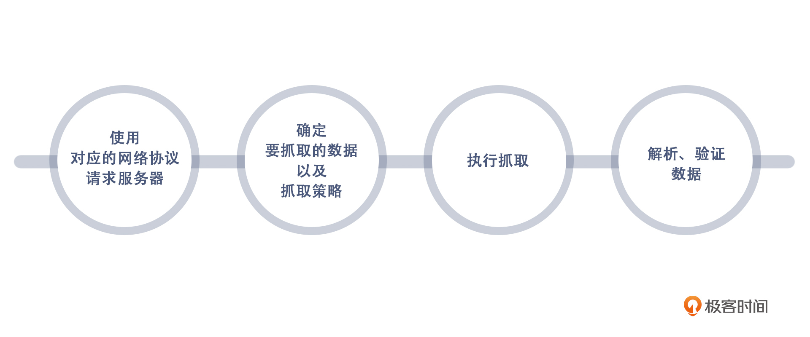
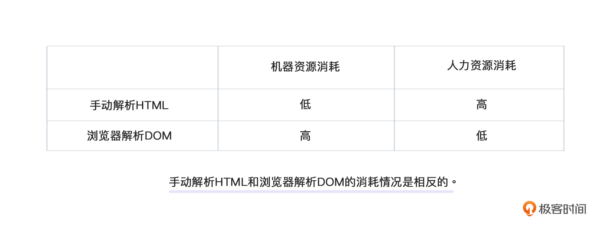

# 04 | 爬虫的首轮攻势：如何低调地拿到自己想要的数据？
<audio src='./04-爬虫的首轮攻势：如何低调地拿到自己想要的数据？.mp3' controls></audio>
你好啊，我是DS Hunter。又见面了。

前面我和你聊了聊爬虫和反爬虫的历史，感觉这是一个内卷的死结。

在 [开篇词](http://time.geekbang.org/column/article/480086) 里我提到过：内卷之下无胜者。也就是内卷一旦开始，你就只有两个结局：输，或者输得很惨。你的所有努力，都是让自己不要输得太惨，而不是考虑如何创造收益。有了这个基本方针之后，我们才能知道后续应该往哪个方向去努力，才好进一步制定对应的策略。

通过第一个模块的历史视角回顾，相信你已经对什么是爬虫有了更深刻的了解。而从这一讲开始，我们就正式进入爬虫、反爬虫的理论环节。接下来所有的讨论，就从发起攻势的爬虫方开始吧。

## 从“5W1H分析法”到爬虫行动

我首先要问你一个问题：老板把任务给你了之后，爬虫要干什么？

根据5W1H原则（万恶的方法论啊），你可以看到，需要讨论的有：WHAT、WHERE、WHEN、WHO、WHY、HOW。那么迁移到爬虫身上呢？

老板把任务布置下来之后，这个WHO就没什么可讨论的了，肯定是你，爱干不干，不干走人。 至于WHY？老板有需求，有什么可WHY的，还是不干就走人。而WHERE，WHEN？当然是Anywhere，Anytime，卷起来！只要对方站点扛得住，就日以继夜地死命干他。后面在06讨论分布式的时候，我会和你分享分享关于WHERE和WHEN的思考。

现在，我们就只剩下了WHAT和HOW。这也就简单了很多。我们的问题只有：爬什么，怎么爬？所以，接下来我会带你了解爬虫的抓取流程。在这个过程中，你就能理解怎么在完成老板需求的同时，保护好自己。而整个过程的关键词只有一个，那就是“低调”。

## 抓取流程

爬虫随着网络而生，那么我们讨论的爬虫要么基于TCP协议，要么基于HTTP相关的协议。也许有些爬虫是爬FTP的，但是这种情况非常少。当然，不管使用什么技术，我们都要始终记住一点： **保持低调。** 毕竟爬虫本身就不是一个光明正大的事情，再高调地去抓取自己想要的东西，就会死得很快。

既然确定了技术方向，那么接下来，就要进行抓取了。根据大多数爬虫系统的经验来看，无论是什么爬虫，我们主要的抓取步骤都是以下四个部分：

其中，最能帮助我们保持低调的就是步骤二和步骤三了。而至于步骤一和步骤四，我会详细地跟你说说和提升能力、降低消耗有关的事情，也会对你有不小的帮助。我们就从第一步开始吧。

### 使用对应的网络协议请求服务器

关于使用对应的网络协议请求服务器，简单来说，就是对方用什么我们就用什么，而Web一定是HTTP，App大部分是TCP。这一句话就可以解释第一步的动作方向了。

今天这一讲，我们 **主要讨论使用HTTP协议请求服务器的情况。** 不要觉得武断，我们还是从历史的角度来进行说明。

我们都知道，在本质上，爬虫就是一个Cosplay。服务器开放了端口给浏览器访问，那么就必然无法验证来访问的是不是一个真的浏览器。

最早我们是使用TCP协议直接发起请求的，写爬虫的人需要创建一个TCP链接，按照HTTP协议的格式逐字节去写入数据，分析返回数据，来实现数据的抓取。

谢天谢地，这种残酷的日子一去不复返了。现在各大语言都直接加入了HTTP请求相关的库，甚至随着爬虫的发展，很多爬虫专用的库也出现了，越做越精细，也越来越不需要你关注底层了。

目前来看， **大多数情况下，我们抓取服务器都是用HTTP协议**，毕竟爬虫是随着Web 2.0发展起来的，而Web 2.0的主要载体就是HTTP。

你可能会觉得，随着App时代的到来，HTTP越来越不吃香，反而是TCP的爬虫又追了上来。但我要说的是，虽然现在各大公司的信息主要以App为主了，不过HTTP爬虫也并非一无是处，首先它可以快速抓取，其次它可以用来辅助验证App的抓取结果。因此HTTP爬虫会长期存在，不会消失，这也就是我们主要讨论HTTP协议请求服务器的原因。

所以，虽然有些HTTP的技巧会慢慢变得不实用，但只要大家没有抛弃 Web，HTTP爬虫就一直有用武之地。

除此之外，关于这里的能力提升，我的建议是：

**去撸一个TCP爬虫。**

> 为什么又到了TCP爬虫？
>
> 原因很简单，爬虫，这个过度封装的Cosplay爱好者，它过度封装之后的好处就是无需关注细节。但是坏处也就是一旦细节出了问题，你根本不知道问题出在哪里。像是03中反向注入的故事，就是在封装好的爬虫的内部动了手脚。因此，直接用底层TCP撸一个线上爬虫用于生产，我是绝对不赞成的，这属于炫技，毫无用处。但是作为入门，这种练习对细节的考察还是很深入的。后续如果碰到高阶反爬虫，在底层原理上下绊，也能处理得游刃有余。
>
> 此外，如果你后续要进阶到App爬虫，大部分是要回到TCP层来抓取的，因为基本上没有哪家App还在使用HTTP协议了，都是自有的定制协议。这类协议要用TCP抓包，然后猜测每个字节的用处。

### 确定抓取数据及抓取策略

确定对应的网络协议请求服务器之后，我们就可以着手准备挑选抓取对象了。

为了后续能够顺利讨论，我们先来明确一下各个名词的含义。

**抓取数据部分**，我们通常会将商品数据分为两类， **重点商品** 和 **热卖商品**。重点商品，可能是我们后续需要观察的商品；热卖商品，则是用户关心的、经常点击的商品。当然，两者可能有重叠。

至于 **抓取数据的手段**，从抓取的时机维度，我们通常将抓取手段分为两类，一类是 **Job抓取**，一类是 **实时抓取**，这两种手段各有优劣。Job类型的抓取，周期性很强，在流量曲线中容易被抓；实时抓取相对来讲不易被抓，但是因为是通过用户点击商品实时触发，所以我方的热卖产品信息，很容易泄露。我们能做的，就是利用它们的优劣来决定我们要抓取的数据和抓取策略。

好了，所有的概念明确之后，我们来看看抓取数据和抓取策略的选定吧。这一步，是我们整个抓取流程的重点之一。想要低调，就要先收一收自己的野心。

毕竟你的老板一定会说：我全都要！但是这并不现实。

不现实的第一个因素： **流量问题**。要知道，你们是竞对，假设你们各占50%的市场份额，这就意味着如果你有N个商品，那对方也有N个商品。你的N个商品要和对方的信息来对比，那么你至少抓取量是N。如果价格实时变化，每天需要抓取k次，那么抓取量就是kN。再假设你的每日PV（Page View，页面浏览量）数是M，那么每个用户在查询价格的时候，你们会触发一个实时比价爬虫，那么对方就会收到M的爬虫流量。这样算下来，对方一共要接受M+kN的流量。

而他是你竞对，你们的PV是M，他的PV十有八九也是这个级别的。这意味着他系统承受的爬虫流量要超过自己业务流量。你如果还奢望在这种情况下隐藏自己，实在是太不现实了。

所以，一定要和老板砍掉“我全都要”这种需求！再次强调， **要低调！**

第二个因素： **爬虫的危险性**。实时爬虫一旦触发，竞对如果借着你的爬虫顺藤摸瓜，记录下来你的热卖产品，然后进行分析，那才是最可怕的。况且，能立刻得到你的销售数据，这一点可比反爬虫本身更有价值。因此，实时爬虫一定不要做！非做不可的话，一定要做随机，不能全量实时抓取，否则，全量实时抓取就等于对方本来不知道你这面的销售数据，结果你主动推送数据给对方。

通过咱们刚刚聊到的两个点，我们可以知道，圈定重点商品之后，再加上部分随机热卖产品，就是我们要抓取的数据了。而我们的抓取策略就是： **重点商品数据用Job抓取，热卖商品数据用实时爬虫抓取。**

最后，还是要和你强调一下，确定数据是爬虫的一个重点，绝对不能随意圈定。尤其是不能让产品经理随意定，屁股决定脑袋，产品经理的职位注定了他们需要尽可能多的数据，如果你问他们一个数据需要不需要，那答案一定是需要。

他们完全不懂爬虫的可怕之处，也不了解反爬虫的阴险之处，即使了解，他们也可能为了自己的业绩，假装不知道。一定要有专业的人来决定这个事情。或者，增设一个爬虫产品经理的岗位，他可以不仅仅对“数据全面”这一个指标负责，也综合考虑公司利益。产品经理并非坏人，KPI才是万恶之源。

### 执行抓取

确定了网络协议、抓取的数据和抓取策略之后，就可以开始执行抓取了。根据第2步我们知道，现在需要抓取的数据被分成了两部分，一部分是重点商品，一部分是热卖商品。我们先来看重点商品部分应该怎么执行抓取。

- **重点商品：Job抓取**

重点商品是走Job的，因此，需要定期触发。Job不要过于频繁，否则就无法低调的抓取。

此外这里有个误区，很多人为了避免对方服务器被抓出问题，就赶在业务低谷期（错过业务高峰）去抓取，这可就大错特错了！

国内业务低谷期一般在凌晨三、四点左右，这个时候，服务器压力的确小了很多。但是你要考虑对方的程序员也都下班了，一旦出了问题，没有人能快速上线解决，只能靠值班的人先壮士断腕——降级熔断，然后再联系对方的程序员。你的本意可能是想对竞争对手好一点、保留一些善意，可是发生这样的事情，是不是与你的预期完全不一样呢？

而高峰期，虽然服务器压力较大，但是要注意，对方的人是齐全的，不管发生什么事情都可以迅速搞定，甚至秒级扩容，这个时候抓取出问题的概率比低谷期还更低一些。这个与我们的直觉可能完全不同。

此外，很多商品可能价格是随时变动的，你大半夜抓个价格，到了白天的时候还有什么参考价值呢？

因此， **Job正常设置，不用刻意挑时间，唯一需要注意的是频率。** 此外， **Job开始，并不意味着抓取开始，Job应该只是将抓取消息发送给节点，具体的抓取时间应该由节点自己来决定。** 简单的说就是：将在外，君命有所不受。

最终节点再将信息汇总，抓取就结束了。这就是Job类型的抓取。

- **热卖商品：实时爬虫**

刚刚提到还有一种抓取就是实时爬虫。这里要注意两点，一个是 **数据范围**，另一个就是 **具体抓取习惯**。

首先，数据范围，也就是商品选择。实时爬虫的范围要尽可能小，并且不能全是热卖商品，一定要再加入一些非关键商品。尽可能将部分头部商品加入池，部分中部产品加入池，然后每天轮换，头部商品和中部商品的比例也要一直调整。

虽然这样会带来业务的一些不满——毕竟他们期待的理想结果是全爬。但是为了保护公司隐私，这是不得不做的策略——并且要尽可能 **保密**。要知道，商场没有太大的秘密可言，如果你信任你的同事，把策略都告诉他了，可能你就是酒足饭饱吹个牛而已。但是下个月，他也许就会跳槽到了竞对。到时候他还会保密吗？

第二点，具体抓取的习惯，一定要是和Job爬虫不一样的。为什么要注意这些问题呢？其实主要是 **怕被对方反抓**。

我们刚刚说过，Job爬虫是非常容易被对方抓的，如果对方抓了之后不拦截你，假装没抓到，就可以根据你的请求特征，顺藤摸瓜抓你的实时爬虫，后果会很恐怖。实时爬虫通常意味着这些商品对你最重要，那么未来在商业上，他们会重点打击这些商品。

如果针对Job爬虫和实时爬虫使用不同的抓取代码，能大大降低这个概率，因为看起来像两拨人，很难串联起来。这样，也就做到了低调。不过因为人的惰性，一般即使用了两套代码，也不会相差特别大，会有相同的个人习惯在里面。

理想的状况，是有足够的资源支持，两个团队互不交流、分别抓取。不过这样的成本实在不低，至少代码库要用两套。但是这样的好处就是，对方即使抓到你了，也会质疑自己的判断，认为不可能是同一拨爬虫。

### 解析、验证数据

拿到了数据却无法快速解析、无法验证真伪，其实就相当于拿到了没用的数据，那接下来我们就一起帮助数据发挥自己的价值。

- **解析数据**

解析数据是个千古难题。

这里推荐一篇叫 [《火星人的耳机》](http://www.cnblogs.com/justinyoung/articles/1125488.html) 的文章给大家。虽然是一篇很老的文章，但是他详细解释了为什么Web标准这么难做，HTML标签那么混乱。

简单来说，就是因为浏览器版本的更新迭代，要持续保持兼容性，因此HTML的解析就变得逐渐混乱起来。遵循标准本身没有商业利益，浏览器厂商动力也不大。加上标准诞生于浏览器之后，不可能让前置的浏览器穿越时空来遵循后制定的标准，这就好比我们不能要求古装剧的人像现在的人去思考，他们有他们那个时代的思考逻辑。

这一点， 直接导致了解析HTML一直以来占据了爬虫的大部分工作量。

谢天谢地，现在有很多库可以支持帮你解析，不用自己来写正则一个一个匹配了。但是碰到畸形的标签，还是要手动调整——甚至对方可能是故意的！很多反爬虫方对一些畸形的HTML标签了如指掌，并且他们知道浏览器可以解析：因为他们可以通过线上用户帮自己去测试。这也就是我们解析数据的第一个方法， **库的支撑和手动调整相结合**。一般说来，这样就不至于自己写正则了。

除此之外， 我们还有一个方法就是 **走浏览器渲染直接拿到DOM**（Document Object Model，文档对象模型）。这种办法原理上没有任何问题，唯一的死穴就是，性能太慢了。DOM渲染是前端一大难题。大部分前段框架，核心的功能就是在减少DOM操作，提高浏览器性能。因此本地拉浏览器引擎进行渲染，并非不能做，但是你需要极大的资源，需要评估是否值得。

总体表现如下表：

我们说过，一旦一个技术问题成为一个ROI问题，那么反倒好办了。你只需要在收益上打平消耗即可。因此，我们现在需要考虑的问题是：我们在解析数据上大概能付出的成本有多少？

从表格中可以看出，浏览器直接解析DOM会导致机器消耗高，而手动解析HTML会导致人力资源消耗高。但我们根据常识可以知道，机器成本是线性的，而人力资源消耗是一次性的，或者认为是边际递减的。所以，如果你的解析量并不大，那么可以考虑用浏览器解析来降低总成本，让机器消耗去吧。而如果解析量很大，那么尽可能使用代码来解析，是时候消耗人力资源了，这样能够获得一个高效率的解析，降低总成本。

- **验证数据**

最后是验证数据，也就是验证你抓取到的数据是不是真实数据。

验证数据有两种，一种是机器验证，一种是人工验证。机器验证在前面我们已经详细介绍过了，还介绍过反爬虫方的反验证方式。因此打到最后，难免会进入人工验证。这里，你也可以参考在 [02](http://time.geekbang.org/column/article/480844) 中的机器人工双校验部分，具体的步骤内容非常详细。今天，我们重点来看看这两种验证方式的注意事项。

首先是 **机器验证**。

机器验证一般就是交叉验证，也就是PC端、小程序等等各个渠道互相校验。但是，这样做会增大对方服务器的压力，会有被发现的风险，因此不是很推荐。

此外机器验证还有一种取巧的办法就是，有意中个爬虫试试，看下对方提价数值是多少。如果你的爬虫也拿到了这个价格， 那就说明你的机器验证策略被发现了。当然，这种办法只能针对那些提价策略并不复杂的反爬虫团队。不过总的来说，还是一个很好的补充手段。

而 **人工验证，则没有任何技术含量，基本就是人工抽检即可。当然，也有一些需要注意** 的事情。

第一，人工验证不再有小概率性事件的概念。你需要时刻记住：你面对的是活生生的人，而不是自然界的随机事件。一旦你的爬虫中了，那就是中了，人工干预的事件，是不符合概率论的。直接丢弃全部数据即可，它们没有一个是可信的。至于何时重试， 需要根据成本来综合考虑。

第二，要熟知对方的业务逻辑，知道价格计算方式，避免因为不了解对方的价格计算模式而误以为自己价格抓错了。例如有些价格与优惠券、地区、用户属性相关等等。如果你不了解，拉到不同的价格就以为自己做错了，将寸步难行。因此验证数据这一步，建议对业务熟悉的人员来操作，而不是通用的测试人员。

基于这一点，我一直反对把爬虫做成中台。中台看起来节约了研发成本，但是天花板实在是太低了。有些公司，前期还能做得有模有样，但是，一旦对方发力做反爬，就无法招架。这就是因为中台方对对方的业务了解程度不高，被欺骗了都不知道。

再看另一个例子，有个公司抓取别人的小说，一直以为自己抓得好好的，实际上都是对方拿别的章节来冒充的。在没有业务端和读者反馈的情况下，技术人员很难发现这一点，甚至还觉得自己特别厉害。

## 总结

好了，到这里，我就介绍完了低调完成爬虫操作的全过程，给你总结一下吧。

首先，我们会使用对应的网络协议请求服务器，这里根据对方服务器使用的协议，我们就可以直接确定我们需要使用的协议。接下来是确定要抓取的数据并且制定抓取策略，这里也是整个工程的重中之重，能不能实现低调就看这个策略了。我们能做的，就是挑选出重点需要关注的商品，舍弃一部分并不重要的商品，甚至为了隐藏自己的商业数据，可以有意减去一些重点商品，避免因小失大。

然后，就是执行抓取了。这里需要注意的是，实时爬虫并不推荐，非做不可的话，一定要注意，把 **低调** 刻在自己的骨子里。尤其是数据集上面，一定要敢于舍去部分重点商品，壮士断腕，避免被对方反向分析，得不偿失。

最后，是数据的解析和验证。解析这里，我为你提供了两种解析方式以及它们的选择方法。记住，只要比对方消耗得少，你就胜利了。而验证的时候，我提到了可以通过有意被抓来验证数据，减小对方服务器的压力来保持低调。

要知道， **低调不低调，不是给机器看的，是给对面的人看的。** 只要对面的人没发现你，那么你就低调成功了。

那么，足够低调的情况下，就能一直抓取了吗？答案是否定的，毕竟这是一个又卖矛又卖盾的课程。下节课，我们就从反爬虫的视角再看看，如何应对爬虫方低调的抓取。

## 思考题

最后，又到了愉快的思考题时间。还是老规矩，三选一，记得保密脱敏啊：

1. 假设你想实现低调的抓取，最多只能支持100QPS。但是要完成老板的需求，最少也要1000QPS。那么，如何解决这个问题？另外，在你眼里，100和1000的QPS，分别是一个什么样的量级？

2. 假设在解析数据的时候，你发现每次解析都会引发一个埋点发送到服务端，证明自己解析成功了。那么，这个埋点你会模拟发送吗？是不发送显得低调，还是同步发送更低调？

3. 如果有畸形的HTML标签要解析，不同浏览器解析方式不一样，你会在user-agent节点锁死浏览器版本吗？

期待你在评论区的分享，我会及时回复。反爬无定式，我们一起探索。

