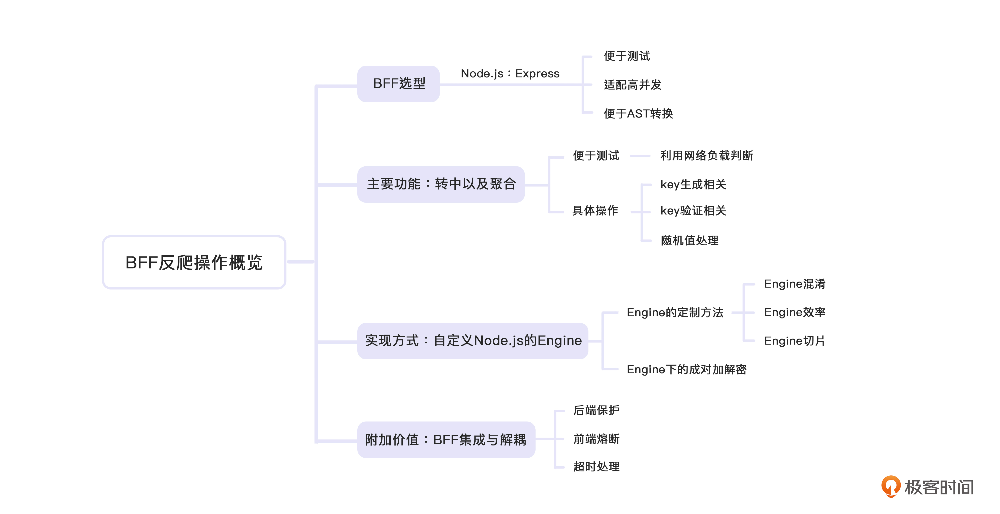

# 12 | 反爬虫概述（四）：前后端都不合适的时候如何进行处理？
<audio src='./12-反爬虫概述（四）：前后端都不合适的时候如何进行处理？.mp3' controls></audio>
你好，我是DS Hunter。

上一讲，我们谈到了无收益的前端是如何为反爬提供基础保障支持的。但是你应该是知道的，前端没有什么秘密可言。那么，那部分前端不能做的，后端不好做的，我们放在哪里处理呢？

是的，最终还是BFF扛下了所有。BFF天生就是为了这些事情而生的。

在当前的浪潮下，大家似乎将BFF与Node.js划了等号，事实上并非如此。BFF：Backend For Frontend，服务于前端的后端，仅仅是一种设计思路，只不过Node.js在当前环境下是最优解而已。实际上，很多公司都会有一个API层来进行服务转发，这一层就相当于BFF层，它未必是Node.js站点。

这一讲，我们就来看一下BFF的主要功能以及实现方式。在学习的过程中，我也希望你能理解BFF存在的真正价值。我们先从BFF形成的第一步：选型，开始了解吧。

## BFF选型

关于BFF选型，理论上我们可以使用任何语言。但是实际上90%以上的公司，最终会选择Node.js。

### Node.js：Express

Node.js可以承载常规http请求，并且因为与前端使用相同的编程语言：JavaScript，因此能很方便的让前端人员兼职掉BFF工作。这是常规公司选型的理由之一。对于反爬来说，我们有更进一步的选型原因：

1. 我们之前提到的加解密是成对出现的，客户端解密，BFF加密，出于方便测试的理由，使用JavaScript做为BFF语言，会十分方便。

2. 反爬虫系统是一个高并发的非关键系统，其余语言需要额外引入支持，Node.js默认是异步的，天生为高并发而生。

3. JavaScript代码处理可能涉及AST转换， Node.js有足够多的工具可以支持。


基于这些理由，Node.js几乎成了唯一解。但是，万事不是绝对的。对于部分公司来说，实在不能选择Node.js的时候，也可以被迫使用别的技术栈。

被迫选择其余技术栈的理由千差万别，但通常是历史原因或基建支持不足。但是，现实世界的架构也常常不是最优解。我这里的建议就是：妥协吧，编码不方便，可以通过增加人力来解决，这不是无解的问题。

## 主要功能：中转以及聚合

BFF的功能，往往是聚焦于网络请求的中转以及聚合。中转很简单，就是前端服务请求过来，BFF承接了请求，然后处理后转发给后端。而聚合，则是多个请求被合并，一次性请求后端，降低后端的QPS。别人用BFF，往往只是用于中转和聚合，而我们享受了BFF的好处，拿来做反爬。那么这里，我们就来讨论一下中转以及聚合部分的机器配置以及相应的反爬操作。

从BFF机器配置来看，我们为了承载高并发，就要增加资源来承载。但是增加哪方面的资源？是机器数，还是增加配置？这个取决于场景。

### 机器配置：网络负载分类

我们经常说高并发高负载，但是实际上业务上存在两种不同的负载方式：一种是请求量多，也就是链接数高。另一种是流量大，或者资源消耗多，也就是每秒的byte数多，或者需要的业务逻辑多。这两者的处理方式是不同的。当然也有业务是两者都多，这就没有什么取巧办法了。

针对链接数高，其实可以通过增加机器数来实现。简单的说，比如你使用1C2G的机器，顶住了网络流量。这个时候，链接数忽然增加到8倍，你是增加至8台1C2G的机器，还是替换成一台8C16G的机器呢？其实两者成本是一致的，但是我们还是会选择8台机器，因为更多的网卡意味着更多的负载。

但是是不是永远这样选择呢？也不一定。我们可以看一下第二种情况：流量大、资源消耗多。这种情况下，可能内存大的“一台8C16G”的机器就是首选了。

当然，事情还有反转的可能，如果系统对实时性要求很高，你可以承受频繁GC，但是不能承受长时间GC，那么可能大内存又不是首选了。这个在选型的时候要慎重考虑。

如果非要有一个结论的话，那么其实反爬虫系统大部分是对实时性有要求，所以低配置多机器数通常是首选。但是这并非绝对的，还是要看具体的需求来慎重选择。

### 具体操作：key与随机值

有了合适的机器，我们就可以考虑具体操作的问题了。我们从反爬验证的核心问题“key的生成”开始说起。

- **key生成相关**

我们在 [09讲](http://time.geekbang.org/column/article/486912) 提到过，key生成逻辑并不复杂，并且无需存储，因此可以直接在BFF生成，不需要动用后端生成再用BFF转发。而且加密本身是一个计算密集型的需求，不是IO密集型，所以这个对CPU的消耗还是比较可观的。

但是，考虑到反爬是一个低ROI的项目，成本节约是重中之重。所以，我们来分析一下目前面临的问题：Node.js天生是为单CPU设计的，而Cluster本身只是充分利用了多核，并没有什么额外的优化。所以对于Docker部署的公司来说，可以把机器分散成多个一核的实例，这样可以充分降低成本。

这里有两个理由。第一，与其用不靠谱的Cluster来实现多核优化，还不如用成熟的Docker技术来隔离，反正总核数不变。第二，核数少的话，配置Docker的人可以使用一些边角料来凑，成本能大大降低。例如公司的k8s人员分配了一堆高配机器之后，还剩余一些机器没办法分配出去，由于我们的需求是单核，因此无论剩余什么边角料，都可以使用上，这个成本能低很多。

此外，考虑到BFF是一个集群，那么发布过程中，需要考虑key兼容的情况。

例如发布了50%的机器，那么50%机器用了新版的key生成与校验逻辑，另外50%还使用的是旧版，这里就会存在发布常见的交叉问题。要么发布过程中停掉反爬，要么在新校验逻辑里要兼容上一版。停掉反爬代价会比较大，而且很难进行线上观察测试。

因此我们的验证模块通常会对上一版做兼容。要知道，key生成并非一个频繁变更的需求，所以必要时可以通过多一次发布来解决这个问题。也就是一次发key的生成方式， 一次发key的验证方式。

- **key验证相关**

key验证方法在 [09](http://time.geekbang.org/column/article/486912) 已经讲过了，这里不再赘述。今天我们主要论述的，是针对刚刚提到key验证中“多一次发布”的问题产生的相对应的key验证问题。

我们先看一下key验证的版本问题是怎么产生的。假设我们的key生成使用的是v1版本，验证使用的也是v1版本。那么，我们要将他们都变更为v2版本。由于发布途中的n台机器，只有1台发布完成了，那么如果用户请求key的时候访问了v2版本生成的key，然后取v1版本去验证key，毫无悬念，这个验证是不可能通过的。那么这个时候我们就需要进行线上版本兼容处理。

**首先，发布的新版本应该支持所有前置版本的key生成以及验证逻辑，并且支持配置。** 例如，我们刚刚发布途中，1台机器支持v2的key生成与验证，n-1台支持v1的生成与验证，那么我们的配置应该是：生成key配置使用v1，验证key配置也使用v1。全部发布完毕之前，实际上线上一直使用的是v1版本。全部发布完毕之后，我们可以将一台机器的key生成调整为v2，而验证key的配置设置为同时支持v1与v2。

这样，线上部分用户使用v2版本的key，大部分用户使用v1的key。慢慢地，就可以逐渐灰度切换为v2版本key了。然后全部切换完毕，v1版本key消失，此时验证key版本设置为v2。我们就可以进行灰度的切换了。

整个过程会缓慢执行， **同时，要时刻监控我们前面提到的误伤统计报表。** 这个报表是实时的，所以可以用来做发布监控，这也是他存在的最大意义。但是这里要注意一个细节：我们误伤检测的理论，是从价格页面带Cookie到订单页面，检测Cookie，假设没有Cookie，就认为没问题。这个在平时没有问题， **但是在发布时要考虑下用户操作延时这点。**

简单的说，用户从价格页到订单页是有一个延迟的，任何一个用户访问了价格，都要通过几分钟各种比较，才会真正下单，根据经验一般是5到15分钟不等（不过这个并非定值，每个公司应该不一样，可以在Cookie上加上时间戳，自己线上测试下符合自己业务的时间段），因此灰度变更的时间间隔不应该小于这个时间差，否则可能导致命名误伤了用户，但是误伤检测还没到，发布的时候误以为策略是安全的，最终因为变更过快，引发生产事故。

- **随机值处理**

从刚刚的发布相关论述中，你会发现，我们通过集群实现了一个随机。实际上，由于集群本身是随机访问的，这里相当于有了一个天生的随机模块。所以我们可以使用集群本身直接做随机。这句话你可能不太理解，没关系，我们还是通过一个例子来讲解具体的操作方式。

举个例子，我们在 [09讲](http://time.geekbang.org/column/article/486912) 中提到过的随机放过。假设你想随机放过50%的爬虫，那么我们并不需要编写随机模块，对每次请求进行roll操作。实际上，通过集群进来的访问已经随机过了，他们被随机并且平均分配到了集群的每一台机器上。你只需要针对50%的机器，配置上“对于任何验证key的请求，不进行验证，直接判定为key正确”，就可以实现50%的随机放过了。

这样不仅降低了代码复杂度，避免出现随机不准的问题，还提升了效率。属于集群使用的小技巧了。当然，这种小技巧除了反爬，似乎也没有别的业务用得到了。

这里可以给你补充一点，那就是如果你需要比较特殊的随机值，例如你有10台机器，你需要的概率却是55%，这个需要变更5.5台机器，很难做到，你可以通过变更Nginx的weight来实现，详情可以参阅Nginx的官方文档。不过这样会导致负载不均衡，因此建议是用工整的随机值。如果不工整，可以向上向下取值到一个合适的值。

## 实现方式：自定义Node.js的engine

实际上，我们可以通过定制Express的Engine，创造一个新的扩展名来避免大量的切片，直接实现BFF中转以及聚合的复杂操作。

### Express的Engine定制方法

我们都知道，Express支持自定义Engine。默认情况下，框架提供了一个非常好用的Engine。但是问题就是，他太好用了，一点也不混乱。而我们做反爬，就是要做混乱，让爬虫方摸不到头脑。因此，定制Engine是一个势在必行的事情。

关于Express如何编写自己的 Engine，可以查阅官方文档。我们这里主要讨论，哪些方面我们要变更。

- **engine混淆**

Engine的混淆主要包括：变量名混淆，eval博弈，AST转换以及虚拟机。

这里，我主要用变量名混淆给你举例。至于其余的混淆方式大同小异，都是定制Engine，只是复杂度会提升不少。所以，我们先用稍简单些的变量名混淆理解基本原理。

我们假设，原来是如下的代码：

```javascript
var a = 3;
var b = 4;
console.log(a-b);

```

但是，我们希望给爬虫方展示的是这样的代码：

```javascript
var $asbasdfewf = 3;
var $asbasdfevf = 4;
console.log($asbasdfewf - $asbasdfevf);

```

明显可以看得出，虽然只有三行的demo，但是下文的阅读难度比上文复杂了不少。

但是我们不能容忍自己在写代码的时候，书写下面的代码。恶心的代码是给爬虫看的，不是给自己看的。那么我们如何处理呢？

我们可以定义一个engine。假设定制完毕后，我们的engine扩展名是as：代表anti-spider， 那么也许你的index.as文件可能看起来类似这样：

```javascript
var $a = 3;
var $b = 4;
console.log($a-$b);

```

然后，你的engine可能定制类似这样的代码：

```javascript
// 遍历模版， 获取所有的变量名。
// 可能是正则， 可能是AST， 看你喜欢， 以及实现难度
// 设置到variables里。
var variables = getAllVariables();
// 根据所有的变量， 创建一个字典， 实现旧变量名与新变量名的一对一mapping。
// 新变量名可以尽可能长， 并尽可能视觉上相似。 例如混用v和w， 1和l之类的。
// 为了避免数字开头， 可以使用通用的开头， 例如$
var dict = createVariableDictionary(variables);
// 批量替换查找到的所有变量名。
// 老规矩， 正则或者AST
replaceAll(page, dict);

```

这样，我们就可以看到干净整洁的代码，而那些恶心的代码，就让爬虫一点点看去吧。

如果上面的代码看着迷惑，没关系，这说明你缺乏的是express定制engine的知识，而不是缺乏反爬虫知识。你先去跟着官网demo定制一个简单的engine看下流程，再回来看就能明白我们要干什么了。

其余的都是用类似的思路去做即可。定制engine虽然是个很非主流的功能，甚至很多人都觉得Express支持这个东西简直匪夷所思。但是对于反爬虫来说，这简直是神器。

- **engine效率**

定制engine最需要注意的就是效率。

我们为了方便，很可能大量使用正则表达式对整个模版进行字符串扫描。这个复杂度至少是O（n）的。而我们又需要频繁扫描，加上不断的局部调整，可能导致CPU过高。众所周知，JavaScript的字符串操作性能堪忧。

因此，这里可以进行一些必要的提速操作。在迫不得已的情况下，甚至可以用其他语言来实现char数组操作，就像编译原理课上的作业一样，尽可能在较少的全字符串扫描中完成任务。这可能会很耗开发资源，但是绝对是值得的。还记得咱们在 [09讲](http://time.geekbang.org/column/article/486912) 中提到过的几乎无解的计算力进攻嘛？这样的改变可以在一定程度上缓解这样几近疯狂的进攻。

也就是说，你消耗的资源不能过高，否则将产生资源的不对等，爬虫消耗的资源远远低于你，你就会陷入被动。而如果你提升了效率，消耗的资源并不高，那么你就可以相对放心很多。

- **engine切片**

切片主要是针对一些浏览器特征检测的。

我们假设你要检测location.href是否存在某个字符串（你的URL包含一个关键字，那么这里location.href就应该包含这个关键字），那么一定不要直接写：如果不包含就如何如何。这样被调试出来的概率太高了，对方只要查找一下if，就知道所有的判定在哪里了。那么这个代码应该怎么写呢？

如果你的某一步加密操作是+3，那么你的代码可以这样写：

```javascript
var offset = 3*(+!!(location.href.indexOf(keyword)+1)

```

> 代码逻辑大概是：
>
> 如果存在keyword，那么+1之后将得到一个大于0的数字。这个数字取反为false，再取反为true，再加个加号就是1了。然后用3来乘这个数字，就得到了正常的offset。
>
> 如果没有找到，那么它是-1，-1+1得到0，两次取反为false，再用加号转为Number，是0，3\*0还是0，这个offset就是0了。
>
> 如果offset错了，那么会导致什么结果呢？会导致key解密错误，最终验证的时候，验证失败。
>
> 但是，整个过程没有任何一个if，是不能直接查找搜索得到结果的。

那么这个代码我们是直接写到解密里面吗？不是的，我们代码里会放3\*1，1就是一个切片，会被替换成这段js判定，在不同条件下运行出不同的结果。

那么替换的动作，就要由Engine来执行了。同时，这个替换是随机的，也就是不同的切片与不同的切片代码来互相替换，实现代码的随机性。我们知道，随机出现的代码是最影响调试的。

当然，这个切片只是个思路，核心在于消除if判定，而不是全篇都是这样操作，要想各种办法来变通。如果千篇一律，对方只要搜索"+!!"这种关键字就可以找到你的切片了。万幸，js有大量的特性（bad parts），可以供我们试用。

### Engine下的成对加解密

我们在 [10讲](http://time.geekbang.org/column/article/487864) 中提到了解密方法是逆排序的，那么这里就可以顺便看下做法了。简单的说，既然是逆序，那就是后进先出，也就是一个简单的栈操作。思路确定后，那么问题就简单了。

大体来说，代码如下：

```javascript
// 首先我们从题库roll出来几各加解密的pair
// 然后把他们临时保存一下
var methods = rollMethods();
// 我们设定一个
var methodStack = [];
// 这里要对methods进行遍历
// 针对key进行加密， 每加密一次， 就在methodStack进行一次push操作
// methods的每一个item应该是一个加解密pair， 加密方法当场用掉，
// 解密方法是一个字符串， 留在栈里备用
methods.forEach...

while(methodStack.length !== 0){
  // 这里则需要不断的popmethodStack了。
  // 然后推给engine， 让engine按顺序拼接解密方法
  // engine拿到解密方法， 进行字符串拼接， 切片注入
  // 以及其余的混淆， 然后加入通用模版， 得到浏览器端最终运行的js代码
}

```

这样，我们的解密method无需与加密method进行mapping，因为加密方法当场用掉了，解密方法拼接到js中了，两者都消费完了。所以不需要再mapping了。浏览器端解密完毕，就直接得到key。如果得不到，那就是解密失败，会被验证模块拦截掉。

## 附加价值：BFF集成与解耦

目前为止，BFF的反爬任务就基本上完成了。但是我们创建BFF不仅仅是替后端做脏活累活的，还需要有更多的价值。我们先从反爬的初心开始讲起。

### 后端保护

反爬虫的初心其实是防止后端收到大流量冲击。现在看来这反倒成了最低级别的需求了。不过我们还是不忘初心，看下BFF是如何保护后端的。

我们知道，真正能冲击后端的爬虫，其实反倒不是那些竞对爬虫，而是毕业生爬虫，他们在毕业季拼命爬取数据， 用来做毕业设计，写论文。而且他们没什么技巧，就是死命干。所以简单的规则封杀就可以操作掉。

这类封杀， 如果在SLB层不方便做，在BFF层可以轻易实现，本质就是一个规则过滤——而我们已经有规则引擎了。因此，触发规则之后，直接设置state为结束，流量就会被忽略掉。后端压力也就得到了降低。 而BFF本身也不用担心，因为在选型时选择了Node.js，应对高并发是天赋，受到的冲击极为有限。

当然，有些公司的BFF，我们提到过不是Node.js……因为一些特殊原因……这种还是死磕SLB去做规则吧。

### 前端熔断

除了保护后端，BFF也可以轻易做到前端的熔断。

我们的反爬验证，无非就是key的生成和key的验证，那么最彻底的熔断当然是不生成key也不验证key。但是有时候线上问题紧急，多个开关操作起来，会互相干扰。

所以，有时候也可以只操作验证key开关，简单的说，就是无论key错得多离谱，我们的规则引擎都默认设置为通过。

我们前面提到过随机放过的操作，可以在集群直接操作。实际上，你把概率设置为100%，所有集群都放过，那么也就等于熔断了。快速熔断，关键时刻可以救命，一定要做好。

### 超时处理

超时处理与熔断其实差不多，那么具体的实现逻辑是怎样的呢？

首先，生成key的时候，不能让用户等太久。如果超时了，那么就可以迅速生成一个指定的key，让他先走掉。固定key很难通过验证的，因此这个报警一定要快，因为误伤可能已经产生了。由于我们的误伤操作通常是操作价格，并不是拦截，因此会给予你一定的时间来处理。

此外，验证key也需要做超时处理。假设一个key验证较长时间还没验证完毕，那么不管哪里逻辑有问题，规则引擎直接给出“验证通过”的结果即可。一定要记住：反爬是一个非关键的业务，抓不到爬虫不可耻，引发生产问题才可耻。

此外还可以设置一些自动熔断的规则。注意，如果这些规则被爬虫抓到，他可能有意触发。所以，还是那句话：具体问题，具体分析。这个需要权衡以及尽可能隐蔽，不要被抓到规律。

## 小结

好了，最后我来给你总结一下。

今天这一讲，我们了解了BFF在反爬虫动作中的一系列问题。从选型开始，到实现反爬虫的详细动作，以及实现反爬虫功能的详细方式都做了详细的讲解。最后，我们也补充了BFF在集成和解耦上面的附加价值。详细的内容我也给你准备了一张脑图，你可以对照着来复习。



但是，这里我更想和你强调几个这一讲的重点，也是BFF在反爬虫这件事上最关键的几点：

1. **自定义Engine：** BFF通过自定义Engine，来实现key的生成以及验证；
2. **通过集群设置随机值：** 使用weight定义机器权重，实现加权分流，并能过控制机器开关实现随机；
3. **BFF小技巧：** 通过自定义随机值来设置熔断、通过设置不验证实现熔断、通过超时处理来提升用户体验。

那么，到这里为止，我们的理论课就告一段落。下一讲，我会带你从头到尾走一遍反爬虫的过程，认真观察这个战场的每个角落。

## 思考题

又到了愉快的思考题时间。 老规矩，你可以任选一个问题和我讨论。

1. 你们的公司出于各种原因，BFF没有选择Node.js技术栈。那么，你是硬着头皮在这种技术栈做反爬呢，还是想办法让BFF转Node.js呢？如果你认为不可能成功，那么理由是什么呢？
2. Express的官方自定义Engine的demo里面，会频繁读文件。虽然Node.js是异步的，但是也顶不住没完没了的读硬盘啊。如何提升性能呢？
3. 集群实现随机，你精心配置，终于实现了79.4%。然后机器扩容，随机值又变了。那么，如何处理这个问题呢？

期待你在评论区的分享，我会及时回复你。反爬无定式，我们一起探索。

