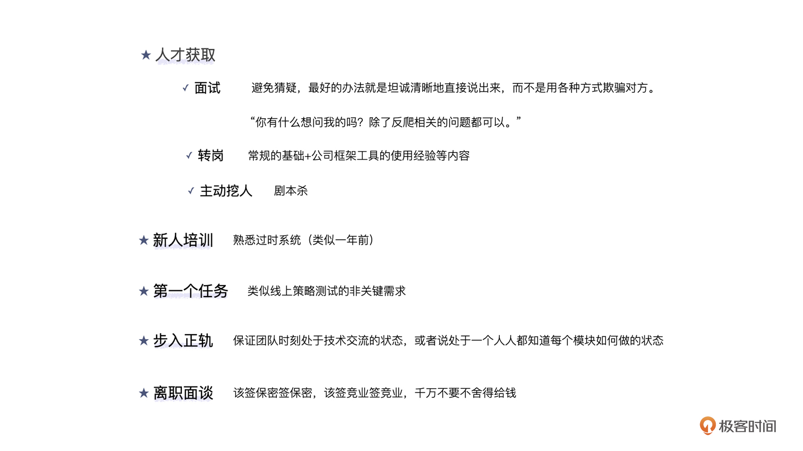

# 19 | 如何搞定老板（中）：如何组建团队
<audio src='./19-如何搞定老板（中）：如何组建团队.mp3' controls></audio>
你好，我是DS Hunter。

上一讲，我们讲了如何编写合适的OKR。如果你运作得顺利，那么你应该申请下了项目，申请了HC。结合再前面的JD如何编写，你可能招到了一些人。目前为止，你可能认为自己的团队已经组建好了。

且慢！不是这样的，并不是人凑够了就叫团队！

就像你打游戏一样，只要凑够了5个人，能去打排位了，这就是一个好的团队了吗？并不是。随着不断的掉分，可能内讧就产生了，甚至刚到逆风局的时候，内讧可能就已经开始了。慢慢的，团队人数越来越少，凑起来的团队也烟消云散了。

因此，我们不但要凑够数量，还要保证质量，才能让团队更稳定。

我们按照时间线一个一个来讨论，从面试到离职，看一下每一步应该如何避雷。

## 第一步：人才获取

先来看第一步，人才获取。根据候选人的不同，我们的人才获取途径主要有面试进来、转岗进来和主动挖人进来三种。

### 面试

反爬虫面试和别的部门是不同的。除了常规考核以外，还有两点要注意：第一要防止自己套面试者方案，引发PR问题。第二是要防止面试者套自己的方案。

套面试者方案比较常见。但是，如果你本来没有想套对方的方案呢？结果对方觉得你只是想套方案，没有诚意，轻则不想来，重则发帖抱怨，引发PR问题。

反爬毕竟是个非主流的方向，而且做法大同小异。即使做法截然不同，在几十分钟的面试里，因为信息获取不全，也可能会给人感觉，大家做得差不多。而我们又提到过，反爬更像一个魔术，一旦解密了，就感觉不到什么技术含量。所以面试者通常对“套方案”戒心很重。和前一讲我们说过的杀熟一样，一旦用户产生了这个戒心，无论你说点什么，他都怀疑你在套方案。

那么如何消除这一戒心呢？

**避免猜疑，最好的办法就是坦诚清晰地直接说出来，而不是用各种方式欺骗对方。** 因此，你可以在开篇直接说类似这样一段话：

> “我们都是做反爬的，我们都知道，很多反爬技巧属于公司机密，不方便透露，部分数值也可能引发泄密风险。因此，在整个面试过程中，你可以主要阐述你们的思路，尽可能避开具体实现方式。至于数值，你可以脱敏后再说，或者直接用较为主观的描述，例如非常好，较好，一般，等等，而无需说出具体数值。毕竟，我们也不希望未来你去面试别的公司的时候，带着我们的数值说给别人”

这样坦诚的开场白，会让候选人尽量放下戒心，能够与你坦然地继续交流。此外，还给了对方一个心理暗示，那就是，我们已经把你当自己的员工来看待了。这样，也有助于对方发挥。

这里要注意一点：面试者紧张，吃亏的不仅仅是面试者，企业也很吃亏。因为很多工作并不需要社交能力，因为缺乏社交能力而导致紧张，进而导致发挥失常，会让你错失优秀的人才。

那么，如何防止对方套自己方案呢？

一般套企业方案，都是在“你有什么问题想问我吗”这个环节。因此，解决方案还是一样的， **坦诚清晰地说：你有什么想问我的吗，除了反爬相关的问题都可以。**

应聘者只要情商不堪忧，就能理解你。所以不用担心。

那么，我们的正题就来了：面试问什么？

这里你要明白一件事情，那就是反爬并不是一个有固定套路的行业，因此面试的时候大家有不同见解，是很正常的。你需要考察的，反倒是计算机基础知识以及灵活的处理技巧。因此比较建议的有：数据结构，前端基础，一些“脑筋急转弯”。但是不同的是，不要预设标准答案， **每个问题都回答到标准答案的人，应该是很难做好反爬的，我们需要的是与众不同，是创新。**

### 转岗

除了面试以外，转岗也是一个非常重要的人才引进途径。

转岗可以分主动转岗和被动转岗。针对主动转岗，我们主要考核的，与面试区别不大。只是除了常规的基础之外，还要 **加一些公司框架工具的使用经验等内容。** 因为大家都是一个公司的，部分框架工具也都是共用的，如果这些使用经验少，那其实就说明了一点：代码写得少。你不希望组建团队的时候招来的是只会写文档的人吧？

而被动转岗，通常指的是因为考评不好，被迫选择变更一个岗位的人。这类人其实比较麻烦，一般我不建议用。因为大部分情况下，双方的最优解其实都是：离职，换个公司。要知道，你收了他，就要给予他一定的承诺，而这些承诺通常对于团队已有的人是不公平的。

当然，如果真的碰到大神级别的（但是这种人如果被打了低绩效，你应该考虑的是，是不是公司出了问题呀，你应该先想想自己的退路了。当然这是题外话），也是可以额外考虑的。在充分与团队做好沟通之后，可以走常规流程。

这个时候面试的内容主要可以围绕绩效问题来讨论。不要怕不好意思说，首先你们是一个公司的，大家没什么可藏着掖着的。其次，他很可能在外面也在找工作，和你谈完之后没准接了外面的offer直接就走了。但需要注意的是，针对低绩效，他的抱怨有多重。低绩效一定会有抱怨，这是人之常情。但是如果全篇都在抱怨环境问题，那么你就要慎重考虑了。

### 主动挖人

主动挖外面的人，是一个周期很长的事情。所以，你要挖的，应该是非常核心的人物才行，不然对不起这么长时间的跟踪。

当然，即使是猎头，也没法完成这种定向的挖人计划。你想想，首先你要对他们足够了解，其次还要引发他对公司的不满，还要在恰当的时间接他过来。这一套流程下来，你可能会怀疑：这真的是人类干得出来的事情吗？

还真可能。这就是社会工程学，你做反爬的必备技能啊。一个最简单的例子，就是你注册他们公司的脉脉，进入他们的职言区。剩下的，就是一场剧本杀了。

## 第二步：新人培训

假设你的面试结束了，保密协议也签了，那么就到了新人培训的阶段了。

普通的新人培训有两种：第一，学习各种基础知识，公司规范，然后慢慢上手；第二，直接扔上战场，在战场中接受培训。

反爬虫的团队与这些都不同。记得我们提到过的“套方案”问题么？你怎么知道这个新人不是来套两个月方案然后就走的呢？

当然，也可能他套了两年方案才走，这个就另说了。要知道，离职后的保密协议与在职的保密协议，用起来效果完全不一样。因此，要避免新员工快进快退。毕竟，他完全可以用“反爬太卷了”为理由离职，你也没什么好的阻止方案。

这个时候，新人的权限就很重要了。如果新人能够接触到所有的反爬系统，那么理论上说他就可以迅速摸清你们的做法，然后光速离职走人了。

因此，注意！反爬千万不要使用实习生！千万不要！

而你需要做的，其实很可悲，是要给新人提供一个蜜罐系统，这个系统可以用来熟悉生产环境，但是又与生产不同。一个比较好的做法，就是 **使用过时的系统，例如一年前的系统，给他熟悉。** 这样，回头给他正式系统的时候，也方便熟悉，也了解了历史的技术债，一举两得。

## 第三步：第一个任务

新人培训到了一定程度，你就可以给予他第一个任务了。

时间虽然不能太短，但是也别拖太长，不要第一个任务都拖过试用期，那就麻烦了。

**第一个任务的性质，应该是一个非关键的需求。** 例如，线上策略测试。这种测试，即使他搞出问题，也不会引发生产故障。

可能你会问：埋点需求总可以吧？感觉这个也不会引发什么问题。

注意！埋点需求虽然本身不会引发问题，但是埋点错误可能导致无法发现生产问题。

举个例子，你让他改误伤埋点，结果他代码有问题，导致所有的误伤都报不过来。这个时候，刚好你们的一个反爬工程师动了规则引擎，导致大量误伤。但是从曲线上看，却是没有任何误伤报告的。这是不是意味着你们会耽误急救的最佳时间呢？这和生产引发的故障其实没有什么区别。

而线上策略测试则不同。首先，线上策略测试，测完了是入库的，暂时不用。其次，一个策略你不可能就测一次，下次测试就相当于校验了一次。最后，这个任务只动策略，不动框架。而我们前面提到过，框架应该提供足够的安全性，保证策略崩了也不会影响生产。

这样，新人就可以平安度过第一个任务了。

## 第四步：步入正轨

新人步入正轨之后，可能你就需要对他全面开放所有的技术细节了。毕竟，反爬团队也不会很大，你也没有太多可以藏着掖着的东西了。这个时候，他应该和一个正常员工一样了——参与整个系统，自己把控一切，注意安全。

这里需要注意的主要有两点，一个是战斗力问题，一个是带新人的问题，我们一起来看一下。

反爬团队人员流动频繁，出于保密需要又不能留下清晰的新人培训文档。因此，你可以理解为这个团队时时刻刻都在进行交接。一个模块，如果只有一个人知道怎么做，那就是危险的。你需要 **保证团队时刻处于技术交流的状态，或者说处于一个人人都知道每个模块如何做的状态。** 甚至，你也可以和爬虫团队密切交流，这就有点去中心化，分布式的感觉了。

这样做，固然会降低效率，但是这是值得的。要知道，人员离职导致的团队战斗力崩溃，才是最可怕的。就像你正开着五黑，但是团队大哥掉线了，那这仗还能打吗？

## 第五步：离职面谈

天下没有不散的筵席。尤其是反爬虫，散得会更快一些。

正常员工离职，离职面谈一般就是走个形式，无非就是青山不改，绿水长流，后会有期。但是反爬虫不同，这里拥有着大量的保密信息，如果离职人员带去竞对，对你们的打击是十分巨大的。因此，需要强调保密的重要性，必要的时候也可以带上法务或者人事一起。 **该签保密签保密，该签竞业签竞业，千万不要不舍得给钱。** 虽然这些钱可能会算入你的成本，但是永远不亏。

如果因为竞业问题导致ROI算不过来，可以和老板商量，操作转组再离职，也就是把成本转嫁给高收益的组。当然，如果你的老板是十分支持反爬的老板，他会同意这样操作的。

## 加餐：技术分享

好了，到了最敏感的话题了：反爬要不要出去做技术分享？

我猜99%的人会说：当然不要啊，反爬这东西，我分享了，别人就知道怎么做了。你前面说过了，魔术一旦被解密，就没有什么神秘的了。出于这个目的，我当然要低调。

没错，我前面强调过多次，爬虫要低调，反爬要低调。

但是你有没有想过，会不会去做分享才是低调的行为呢？

当你出去做了反爬的分享之后，全世界都看着你，你的竞对自然也盯着你的分享，试图找到你的技术突破口。

你在分享的时候，基本上也是知无不言，坦诚清晰地向全世界都讲述了自己的全部干货。全世界都知道了：哦，原来你们公司是这么做反爬的啊。于是纷纷按照你给的思路去做了。

但是，你给的思路里面，如果还有其它偷偷埋的一些小陷阱没有对外说出去，这算欺骗观众吗？

当然不算。如果说，漏说了什么事情就算欺骗，那这个世界几乎所有的演讲都是在欺骗观众啊！

这个时候，全天下的人纷纷在你预设的道路上，踩着你的陷阱，还全然不知，没有一个人肯回头去换一条路走。你觉得，这对你是好事还是坏事？反过来想，这是低调，还是不低调？

这简直就是一个大型社会工程学现场啊！

## 小结

这一讲，我们主要探讨了反爬团队创建中，一个新人从入职到离职的全过程。

你应该已经发现了，虽然人员管理并不是团队建设的全部，但是反爬人员管理的整个过程，却是和其余团队差别最大的一点。我们从新人的面试，培训，上手，工作，到离职，都给予了详尽的探讨。这里呢，我也给你准备了一个团队建设的关键流程笔记供你参考。

最后，我们还在加餐环节，探讨了技术分享的优势所在。当然了，也欢迎你未来参与到极客邦的各种技术分享中。分享时思想碰撞出来的火花，往往更加迷人。

## 思考题

好了，又到了愉快的思考题时间。老规矩,三选一。

1. 如果分享之后，对手纷纷跳入了你的陷阱，只有一个对手跳过了陷阱，走向终点。你觉得他是听了分享才过去的，还是一直能跳过陷阱？
2. 如果你给离职员工签竞业，被质疑乱花公司的钱，你如何解释这一切？
3. 主动挖人要认证竞对公司的脉脉，但是明显你没有他们公司的邮箱，你如何解决这一问题呢？

期待你在评论区的分享，我会及时回复你。反爬无定式，我们一起探索。

