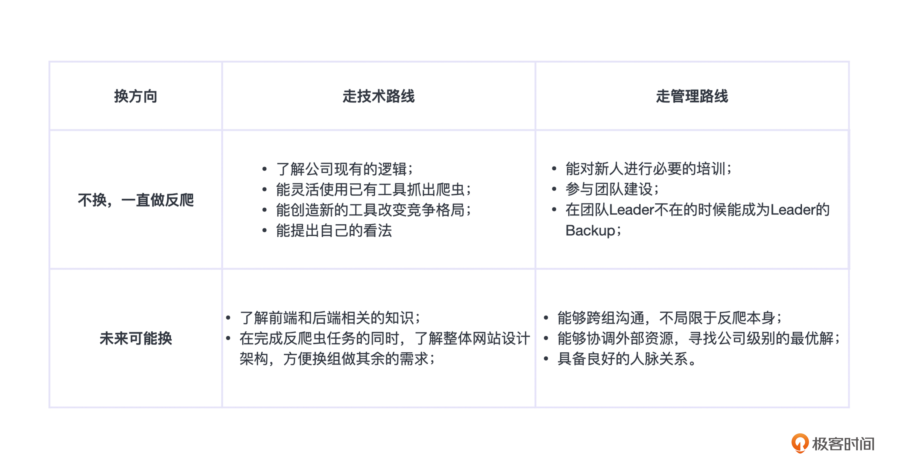

# 20 | 如何搞定老板（下）：团队考核怎么做？
<audio src='./20-如何搞定老板（下）：团队考核怎么做？.mp3' controls></audio>
你好，我是DS Hunter。这是本专栏正文的最后一讲了，恭喜你坚持到了最后！

在整个进阶篇里，你招好了人，搭好了团队，到了最后，你的团队也许已经获得了一定的业绩。而年底应该也到了，又到了愉快的发奖金时间。

对于没有做过管理的人来说，考评是一个很容易的事情。而做过管理的人都知道，这简直不是人干的事。

那么，考评到底哪里难呢？

**员工对考评不满意，本质上就是预期管理出现了问题**。每个人都会高估自己，可是考评的结果一般都会低估自己，这个落差是大部分人不能承受的——除非领导给的是考评的上限，否则一般都不满意。而考评上限，又只有有限的人可以拿到，因此，大部分人一定是不满意考评结果的，只是不满意的程度各不相同而已。

这个时候你可能会说：老师，我知道了，本质是预期管理的问题，那我降低他的预期，不是就能解决这个问题了吗？

恭喜你，无师自通了PUA的知识。啊，但这并不是一个好事情。

PUA能够帮你顺利度过考评，但导致的结果却是，被PUA的人真的认为自己能力不行，最终丧失成长的机会，而你会收获一个很听话，但是没什么战斗力的团队。

如果是做别的项目，也许这还可以接受。但是你负责的是反爬虫团队，这意味着一定不能没有战斗力。反爬虫没有战斗力，那还不如解散了。

因此， **你可以试试和老板申请额外的考评流程。** 相信我，别的团队也许不行，但反爬团队是很容易申请下来的。至少，你可以申请免除差评。一般公司考核是按照总数来配平的，因此大的团队可以在总体上配平，局部小团队可以单独操作。不过不能对外公布，否则容易引发其余团队的抗议。

这里还是要注意：要想获得这种“特殊待遇”，你的业绩要够啊。不然就不要想了。

**考评本质上就是分蛋糕的问题。** 你的蛋糕够大，怎么分大家都满意。你的蛋糕不够大，怎么分都不行。这个是大前提。而我们所有做法的目的，都是最大化地提升反爬虫这个团队的战斗力。

在你的蛋糕够分的情况下，我们来看下考评常见的一些问题。

## FAQ 1：公开还是不公开

薪资不公开，并不是什么神秘的操作。几乎所有的公司都有“薪资保密”这一条规定。原因其实很简单，每个人都会高估自己的实力，因此即使按照能力定了完美的薪资，也会让所有人都感觉自己亏了。就像前面提的杀熟一样，有的人可能会有这种“被害妄想症”的心态。因此薪资不公开，似乎没有什么道理可讲。

不过，难道薪资真的是秘密吗？并不是。

事实上，线下大家讨论薪资，并不是什么稀奇事，只是表面上假装不知道而已。实际上线下已经一个个摸得差不多了。

那么，在这种“薪资似乎成了一个公开信息”的情况下，我们要不要干脆就公开了呢？

不可以！

虽然我们经常看到一些新闻，说某公司薪资是公开的，如何如何好，但是注意，别人能做到的事情，你不一定做得到，因为团队的文化氛围不一样。我见过有些团队，真的就毫无争强好胜的心理，彼此之间都嘻嘻哈哈的。后来一打听，哦，原来每个人工资都不高，也没啥好争的。

互联网公司，薪资方差非常大，很容易引发大家争强好胜的心理。所谓“不患寡而患不均”，就是这个意思了。因此，公司设定 **薪资保密这一点，其实是给你降低管理压力了。**

何况，即使你真的克服万难，实现了“以能力定薪资”，那么你有一个量化的模型来考核反爬的能力吗？说实话，这个很难。有时候谁立功了，完全就是运气好，和能力没啥关系。也就是说，这个时候很容易就变成随机定薪了，会引发更大的不满。

所以，即使你可能现在心里不满意这种做法，觉得“如果我做了领导一定要改变这个世界的规则”，但是我还是建议你，至少，在刚做领导的前两年，不要试图去改变规则。

有些规则，自然有他的道理。

## FAQ 2：升职加薪要不要分开操作

大部分情况下，升职一定加薪。而不升职的，按照规定，也有一部分人可以调整。

可能有些人就会疑惑了：唉，为什么我升职了，反倒不如没升职的人加得多呢？

这是因为大部分公司的升职，是给予Leader一个总包，总包之内随意分配。升职或者不升职，给予不同的上限。但是，注意，这就和你游戏里的攻击上限是一样的，你的攻击力是0-50，他的攻击力是0-20，你打的攻击力就比他高吗？不一定啊，你可能只打到了15，但他可能打到了20的上限，这都是合理的数值啊。 **换句话说，即使升职的人理论上应该涨得更多，但由于种种原因，还是会达不到上限。**

那么，为什么要做这种奇怪的操作呢？

原因可能是多方面的，有可能是你画的大饼到期了要兑现，有可能是升职的人有额外的期权激励，等等。

那么你也许会问了：反爬团队需要这样操作吗？

这个问题的答案是：其实不是需要不需要，而是你根本无法避免这种事情。理论上说，如果真的追求公平，那就应该只有升职的才加薪。不升职的加薪，理论上说都是暗箱操作，因为这个不用公开，但是升职是公开信息。但是， **你做不到绝对的公正，总是有一些让人为难的操作。**

## FAQ 3：要不要大锅饭

不要！

这个问题的答案其实相当明确。虽然我们前面提到了“不患寡而患不均”，可能你会觉得，大锅饭刚好解决了这个问题啊，每个人加一点，雨露均沾，大家都没有特别不开心。

但是，这样做的结果就是，每个人都觉得自己亏了。

记不记得我们刚刚说，要让团队更有战斗力？大锅饭的结果就是，每个人都觉得自己亏了，回头心思各异，人心散了，队伍不好带。

此外，大锅饭会导致一个温水煮青蛙的效果，最终大家都不肯离职。

当然了，大家都不离职，从公司管理角度来说，可能会觉得你工作做得好，人员稳定。但是，这是最优解吗？要知道，跳槽到外面，很多公司会卡30%的涨幅，但是你的大锅饭，能给几个人30%的涨幅呢？

我们做管理，切记不要贪图指标。很多指标其实并不合理，只是找不到更好的办法不得不定而已。大锅饭是最容易完成指标的，但是也是最容易让战斗力崩溃的。要知道，反爬拼的就是团队战斗力，这一点远远超过价值观和方法论。

那么正确的做法是什么呢？

**正确的做法是，给头部的人最大程度的加薪，保证这些人持续输出战斗力。** 团队内所有的人，如果有离职倾向，尽可能挽留。但是，如果实在留不下来，也要真心祝福他们有一个更好的未来。毕竟，人生路漫漫，他们今天是你的下属，明天也许就成了你的上级。

当然了，别忘了签保密协议和竞业禁止。竞业禁止注意范围，只需要不去竞对即可，不要让人家没工作可找。

## FAQ 4：如何正确的画大饼

画大饼，现在已经是一个贬义词了。似乎领导只会画大饼，不会做正事一样。

但是，画大饼，我们换个词来说——“构建长远的目标”，咦，是不是忽然就感觉没那么贬义了？

事实上，排除纯忽悠的画大饼以外，大部分情况下，大家感觉到的“大饼”，其实是正经的职业规划。只不过，很多人自己做不了职业规划，最终是Leader帮着给做了。而Leader没法帮你做五年、十年的规划，毕竟你也呆不了这么久。他只能帮你做个一年两年的规划。而一旦这个规划稍稍长远一点，就会给人一种画大饼的感觉。

虽然下属会误会，但是该做的规划还是要做。一个合格的Leader，最重要的就是帮助下属成长，少走弯路——至少不要走自己走过的弯路。

那么这个时候，你的下属面临的规划选择有：

有了这样清晰的规划，一切将不再沦为虚无缥缈的大饼。当然，最关键的是， **你如果承诺了什么，那就一定要实现。** 如果因为一些原因不能实现了，例如你离开了岗位，那么也一定要把这个当“遗嘱”留给下一任，不论怎样，一定要实现承诺。Leader岗位，很多时候是靠信任度来支撑的。如果失去了信任，别人很难跟你去奋斗。

一旦能够兑现自己的承诺，那大饼也将不再是大饼，而是美味的蛋糕。

## FAQ 5：下属虚线带人，要不要听取考评建议

虚线带人，是一个很奇葩的发明。部分公司为了避免层级过深，发明了扁平化这个做法。但是，毕竟一个人的经历是有限的，那么相应的，他的管理能力也是有上限的，所以就被迫发明了“虚线”这种玩法。也就是一个人下面带了几十上百号人，然后挑出小组长，小组长带人，但是小组长没有考评权，他们只有考评建议给你。

这种做法，我一直觉得很奇葩。为什么？你想一下，如果你的代码长度过长了，一个函数管理不过来，你会怎么办？

当然是抽取成子函数啊。

你会把代码用空格分开，假装他们成了不同的组，然后骗自己说：看，我每个组都不超过多少行哦！会这样自欺欺人吗？

肯定不会啊。

所以，为什么到了管理人的时候，就喜欢这么自欺欺人呢？

反爬也是一样的道理，我们是One Team，但是本身有分工的存在，如果你真的让一个人带了团队，那么就正常给他考评权利，不然下属给他干的时候，自己心里也很虚：我要不要好好听他的话？最后他又不给我考评，万一我一年白干了呢？

这样谈何战斗力呢？

但是假设你就是在这样的公司，公司制度不是你能够变更的。那么，你如何处理这个事情呢？要听取“组长”的考评建议吗？

正确答案是：当然要听取。

不但考评的时候要听取，更要提前很久就要告诉大家，99%的情况下你会直接使用他的考评，而不会进行变更。这样相当于授权给他，也就相当于给了尚方宝剑。这样，他才能真正意义上指挥的动其他的人，让大家发挥100%的战斗力。Leader这个岗位，权利与义务是对等的。你不能让他有义务对项目负责，但是又不给他任何权利——这不是欺负老实人吗。

## 小结

这一讲，我们谈了一些关于考评，也就是考核的相关事情。包括薪资的公开性，升职加薪分离操作的原因，大锅饭的坏处以及职业规划相关的讨论。在这里，我们要时刻记住一点： **首先要让大家成长，让公司有收益，然后再考虑自己的指标。** 这个似乎说起来轻松，但是操作起来还是很困难的。毕竟，指标才是你的，其余的都是别人的呀！

你可能会说：老师，怎么感觉并没有提具体的考核操作呢？

主要是因为，各个公司的考核操作千差万别，但是最终还是给Leader留下了极大的发挥空间，因此知道了具体的指导思想，就可以在任何一家公司进行考评操作。注意，这一讲里面的推荐做法，很多时候并不是主流的Leader做法，更多的是一种理想主义的推荐操作，如果在你们公司不具备落地性， **你可以进行一定的微调，但是不要调整到反面去。**

如果你还没有成为一个管理者，可能会觉得这一讲只是说了一些做人的基本道理。但是如果你已经是管理者了，或者有一天成为了管理者，你可能会反过来感慨：

“真的好难啊！”

好了，随着这一讲的结束，我们的整个课程也就到了尾声。整个课程，我们探讨了反爬虫相关的理论，实践知识，以及可能存在的团队建设理论。反爬无止境，记住，我们是在一起探索，而不是单向的输出小的技巧。

我们再重申一次： **反爬是一个腐蚀人心智的行业，而管理也是一件腐蚀人心智的事情，那么，做着反爬的管理，你还能保持纯真善良的心吗？** 我们的本意是让世界变得更好，千万不要被KPI压昏了头脑，变成反面呀！不要像阿尔萨斯一样拔出宝剑，成为了屠龙勇士，然后转身像恶龙一样，坐上巫妖王的宝座。

虽然没有下一讲了，但是我们永远可以在评论区见！

## 思考题

情绪都调动完了，结果还有思考题呢，好了，安可时间。

1. 大家为了反爬付出了艰辛的努力，甚至包括彻夜与对手的对抗。到了年底，你的老板强制你团队出一个差评。你会如何处理呢？
2. 下属和你谈，非竞对挖他，涨薪40%。这个时候你预估了一下，你最高可以给他涨30%，但是这样做了之后，其余的成员的下次调薪就会受到影响。你会硬着头皮用掉这30%把他留下吗？
3. 你在反爬的注释里写：我们团队待遇如何如何好。借此来扰乱竞对的军心。这个时候，你手下一个薪资极低的人跑来问你：老大，你在注释里写了我们待遇那么好，是不是真的？这个时候，你会如何回答呢？

期待你的分享，我们永远可以在评论区沟通交流！

